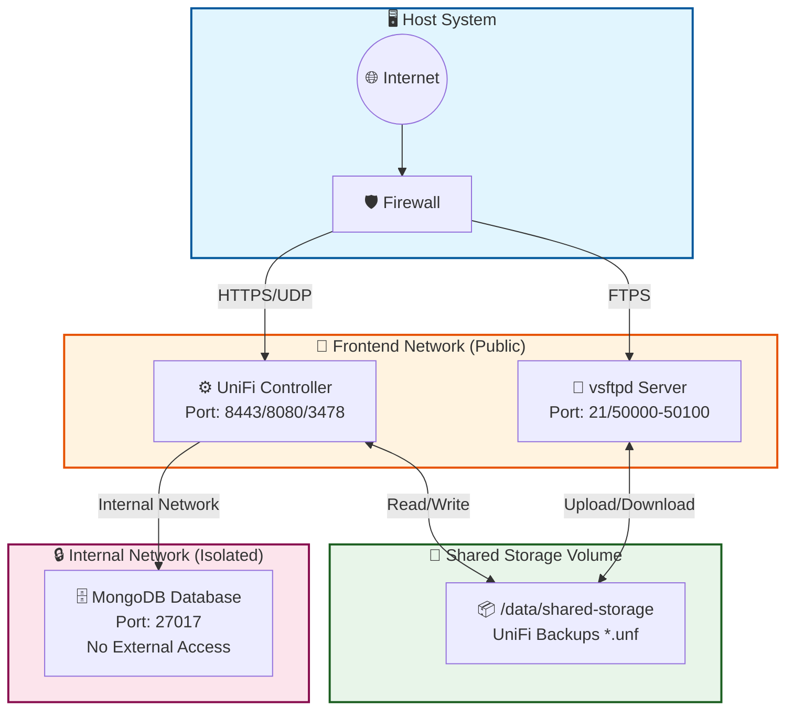

# 🌐 UniFi Network OS Docker Suite

[](https://www.docker.com/)
[](https://ui.com)
[](https://www.mongodb.com/)
[](https://security.appspot.com/vsftpd.html)

> **Production-ready Docker deployments for UniFi Network Controller with integrated secure FTP backup servers**

---

## 📖 Table of Contents

- [Overview](#-overview)
- [Quick Comparison](#-quick-comparison)
- [Live Architecture Diagrams](#-live-architecture-diagrams)
- [Deployments](#-deployments)
  - [1. UniFi Network OS](#1-unifi-network-os----universal-deployment)
  - [2. Enterprise File System](#2-enterprise-file-system----production-grade)
  - [3. UCK-G2 Optimized](#3-uck-g2-optimized----low-resource-devices)
  - [4. Auto Node](#4-auto-node----coming-soon)
- [Security Features](#-security-features)
- [Prerequisites](#-prerequisites)
- [Getting Started](#-getting-started)
- [Port Reference](#-port-reference)
- [Backup Strategy](#-backup-strategy)
- [Management Commands](#-management-commands)
- [Troubleshooting](#-troubleshooting)
- [Contributing](#-contributing)
- [License](#-license)

---

## 🎯 Overview

This repository provides **four distinct deployment options** for running UniFi Network Controller in Docker environments, each tailored for specific use cases and hardware configurations. All deployments include an integrated **vsftpd FTP server** for secure backup operations and file storage.

### Key Benefits

| Feature | Benefit |
|---------|---------|
| 🔐 **Secure by Default** | SSL/TLS encryption, strong passwords, network isolation |
| 🚀 **Auto-Configuration** | Hardware detection, dynamic resource allocation |
| 💾 **Integrated Backups** | Built-in FTP server for automated UniFi backups |
| 📊 **Production Ready** | Health checks, logging, resource limits |
| 🔄 **Multi-Architecture** | ARM64 (Cloud Key/Pi) & AMD64 (Server/PC) support |

---

## ⚡ Quick Comparison

### Resource Requirements Table

| Deployment Type | RAM Min | CPU Min | Storage | Best For |
|-----------------|---------|---------|---------|----------|
| **Network OS** | 2 GB | 2 Cores | 15 GB | General Use |
| **Enterprise FS** | 2 GB | 2 Cores | 15 GB | Production |
| **UCK-G2 Optimized** | 1 GB | 2 Cores | 5 GB | Cloud Key |
| **Auto Node** | TBA | TBA | TBA | Automation |

### Feature Comparison Matrix

| Feature | Network OS | Enterprise FS | UCK-G2 Opt |
|---------|:----------:|:-------------:|:----------:|
| Hardware Auto-Detection | ✅ | ✅ | ✅ |
| Network Isolation | ❌ | ✅ | ✅ |
| Health Checks | ❌ | ✅ | ❌ |
| Resource Limits | Dynamic | Advanced | Fixed |
| Flash Protection | ✅ | ❌ | ✅ (tmpfs) |
| Rate Limiting | Basic | Advanced | Basic |
| Logging Rotation | Standard | Professional | Minimal |
| SSL/TLS Encryption | ✅ | ✅ | ✅ |
| Multi-Architecture | ARM/AMD | AMD64 | ARM64 |

### Complexity vs Features

```
Complexity Level:     ★☆☆☆☆        ★★☆☆☆        ★★★☆☆        ★★★★☆
                     Simple       Moderate      Advanced    Expert
                         │            │            │            │
Deployments:    [Network OS]  [UCK-G2 Opt] [Enterprise] [Auto Node*]
                         │            │            │            │
Features:          Basic      Optimized      Full       Dynamic
                     │            │            │            │
Target:         Any Device   Cloud Key    Production   Automated
                                              Server       Env

*Coming Soon
```

---

## 🏗️ Live Architecture Diagrams

### Interactive System Flow (Mermaid)



### Enterprise Deployment Architecture (ASCII)

```
┌─────────────────────────────────────────────────────────────────────────┐
│                         FRONTEND NETWORK (Public)                        │
│  ┌──────────────────────────────────────────────────────────────────┐   │
│  │                                                                   │   │
│  │    ┌─────────────────┐              ┌─────────────────┐          │   │
│  │    │   UniFi         │◄────────────►│    vsftpd       │          │   │
│  │    │   Controller    │   Shared     │    FTP Server   │          │   │
│  │    │   Port: 8443    │   Storage    │    Port: 21     │          │   │
│  │    └────────┬────────┘              └────────▲────────┘          │   │
│  │             │                                │                    │   │
│  │             │        ┌───────────────────────┘                    │   │
│  │             │        │                                            │   │
│  ├─────────────┼────────┼────────────────────────────────────────────┤   │
│  │             ▼        ▼                                            │   │
│  │    ┌──────────────────────────────────────────────────────────┐   │   │
│  │    │              SHARED STORAGE VOLUME                        │   │   │
│  │    │            /data/shared-storage                           │   │   │
│  │    │   ┌─────────────────┐  ┌─────────────────┐               │   │   │
│  │    │   │ UniFi Backups   │◄─┤ FTP Access      │               │   │   │
│  │    │   │ *.unf files     │  │ Upload/Download │               │   │   │
│  │    │   └─────────────────┘  └─────────────────┘               │   │   │
│  │    └──────────────────────────────────────────────────────────┘   │   │
│  │                                                                   │   │
│  └───────────────────────────────────────────────────────────────────┘   │
├─────────────────────────────────────────────────────────────────────────┤
│                       INTERNAL NETWORK (Isolated)                        │
│  ┌──────────────────────────────────────────────────────────────────┐   │
│  │    ┌─────────────────┐                                           │   │
│  │    │   MongoDB       │◄────── No External Access ─────► BLOCKED │   │
│  │    │   Database      │                                           │   │
│  │    │   Port: 27017   │                                           │   │
│  │    └─────────────────┘                                           │   │
│  └──────────────────────────────────────────────────────────────────┘   │
└─────────────────────────────────────────────────────────────────────────┘

Legend:
  ► Data Flow         ── Network Boundary    ◄► Bidirectional Access
```

### Security Layers Visualization

```
┌─────────────────────────────────────────────────────────────────┐
│                    🛡️ SECURITY LAYERS                          │
├─────────────────────────────────────────────────────────────────┤
│  Layer 7: Application                                           │
│  ┌───────────────────────────────────────────────────────────┐  │
│  │  • SSL/TLS Encryption (FTPS)                              │  │
│  │  • Strong Password Generation (24-32 chars)               │  │
│  │  • Anonymous FTP Access Disabled                          │  │
│  └───────────────────────────────────────────────────────────┘  │
│                          ▼                                      │
│  Layer 4: Network                                               │
│  ┌───────────────────────────────────────────────────────────┐  │
│  │  • Isolated Internal Network (MongoDB)                    │  │
│  │  • Separate Frontend Network (UniFi + FTP)                │  │
│  │  • Port Conflict Detection                                │  │
│  └───────────────────────────────────────────────────────────┘  │
│                          ▼                                      │
│  Layer 2: Container                                             │
│  ┌───────────────────────────────────────────────────────────┐  │
│  │  • CPU/Memory Resource Limits                             │  │
│  │  • PID Limits                                             │  │
│  │  • Storage Quotas                                         │  │
│  │  • Health Checks with Auto-Recovery                       │  │
│  └───────────────────────────────────────────────────────────┘  │
│                          ▼                                      │
│  Layer 1: Host                                                  │
│  ┌───────────────────────────────────────────────────────────┐  │
│  │  • Root Privilege Enforcement                             │  │
│  │  • Secure File Permissions (UID 1000)                     │  │
│  │  • Flash Storage Protection (tmpfs for logs)              │  │
│  └───────────────────────────────────────────────────────────┘  │
└─────────────────────────────────────────────────────────────────┘
```

### Backup Workflow Animation

```
┌─────────────┐      ┌──────────────┐      ┌─────────────┐      ┌──────────────┐
│   UniFi     │      │   Shared     │      │    FTP      │      │   External   │
│  Controller │      │   Storage    │      │   Server    │      │   Client     │
└──────┬──────┘      └──────┬───────┘      └──────┬──────┘      └──────┬───────┘
       │                    │                      │                    │
       │  1. Create Backup  │                      │                    │
       │───────────────────>│                      │                    │
       │   (*.unf file)     │                      │                    │
       │                    │                      │                    │
       │                    │  2. Store File       │                    │
       │                    │<─────────────────────│                    │
       │                    │   (Write to disk)    │                    │
       │                    │                      │                    │
       │                    │  3. Notify Ready     │                    │
       │<───────────────────│                      │                    │
       │                    │                      │                    │
       │                    │                      │  4. FTP Connect    │
       │                    │                      │<───────────────────│
       │                    │                      │   (FTPS Session)   │
       │                    │                      │                    │
       │                    │  5. Download Backup  │                    │
       │                    │─────────────────────>│                    │
       │                    │   (*.unf via SSL)    │                    │
       │                    │                      │                    │
       │                    │                      │  6. Transfer       │
       │                    │                      │───────────────────>│
       │                    │                      │   Complete ✓       │
       │                    │                      │                    │

Time:  ───────────────────────────────────────────────────────────────────>
```

---

## 🚀 Deployments

### 1. UniFi Network OS – 🌍 Universal Deployment

**Best for**: General purpose deployment on any hardware (Raspberry Pi, Cloud Key, Server, PC)

<details>
<summary><b>📋 Click to expand features</b></summary>

#### Features
- ✅ Hardware auto-detection (ARM64 & AMD64)
- ✅ Dynamic resource allocation based on RAM/CPU
- ✅ Secure credential generation (24-32 char passwords)
- ✅ Flash storage protection for SD/eMMC devices
- ✅ Single-file deployment script

#### Quick Start
```bash
cd unifi-network-os
sudo ./setup.sh
```

#### Access After Setup
- **UniFi Controller**: `https://<SERVER_IP>:8443`
- **FTP Server**: `ftps://<SERVER_IP>:21`
- **FTP User**: `unifi_backup`
- **FTP Password**: Displayed after setup

</details>

---

### 2. Enterprise File System – 🏢 Production Grade

**Best for**: Production environments with advanced security and performance requirements

<details>
<summary><b>📋 Click to expand features</b></summary>

#### Features
- ✅ **Network Isolation**: Separate internal network for database
- ✅ **Port Conflict Detection**: Validates ports before deployment
- ✅ **Health Monitoring**: Automated service health checks with auto-recovery
- ✅ **SSL/TLS Encryption**: FTPS (FTP over SSL) for secure transfers
- ✅ **Resource Optimization**: MongoDB WiredTiger cache tuning + JVM optimization
- ✅ **Connection Rate Limiting**: 100KB/s, 20 max clients, 5 per IP
- ✅ **Professional Logging**: JSON log drivers with rotation

#### Architecture Highlights
```
Frontend Network: 172.29.0.0/24
  ├── UniFi Controller (Ports: 8443, 8080, 3478, 10001)
  └── vsftpd Server (Ports: 21, 30000-30010)

Internal Network: 172.28.0.0/24 (Isolated)
  └── MongoDB Database (Port: 27017) - No external access
```

#### Quick Start
```bash
cd unifi-enterprise-fs
sudo ./scripts/setup.sh
```

#### What Happens During Setup
1. ✅ Root privilege verification
2. ✅ Docker daemon validation
3. ✅ Hardware analysis (RAM, CPU, disk)
4. ✅ Network scan & port conflict detection
5. ✅ Secure credential generation
6. ✅ Environment configuration (.env)
7. ✅ Directory setup with proper permissions
8. ✅ Service deployment & health verification

#### Access After Setup
- **UniFi Controller**: `https://<SERVER_IP>:8443`
- **FTP Server**: `ftps://<SERVER_IP>:21`
- **FTP Username**: `unifi_backup`
- **Database**: Internal only (credentials saved in `.env`)

📖 **Full Documentation**: [unifi-enterprise-fs/README.md](unifi-enterprise-fs/README.md)

</details>

---

### 3. UCK-G2 Optimized – 📱 Low Resource Devices

**Best for**: UniFi Cloud Key Gen2, Raspberry Pi, and similar constrained devices (1GB RAM, ARM64)

<details>
<summary><b>📋 Click to expand features</b></summary>

#### Resource Allocation

| Service | Memory | CPU | Storage Limit |
|---------|--------|-----|---------------|
| MongoDB | 300MB | 0.5 | 2GB |
| UniFi Controller | 300MB | 1.0 | 3GB |
| vsftpd | 64MB | 0.25 | 500MB |

#### Features
- ✅ ARM64 optimized images (`platform: linux/arm64`)
- ✅ Conservative memory limits (256M JVM heap)
- ✅ Storage quota enforcement via `storage_opt`
- ✅ Serial GC for low-memory Java (`-XX:+UseSerialGC`)
- ✅ Minimal footprint design with tmpfs for logs
- ✅ PIDs limit enforcement (512-1024 max)
- ✅ ulimits configuration (nofile: 1024)

#### Quick Start
```bash
cd unifi-uck-g2-opt
sudo ./scripts/setup.sh
```

#### Storage Management
```bash
# Check storage usage per volume
./scripts/storage-info.sh
```

#### Access
- **UniFi**: `https://<IP>:8443`
- **FTP**: `ftps://<IP>:21` (user: `unifi_backup`)
- **Ports**: 8443, 8080, 8448, 3478/udp, 10001/udp, 1900/udp

📖 **Full Documentation**: [unifi-uck-g2-opt/README.md](unifi-uck-g2-opt/README.md)

</details>

---

### 4. Auto Node – 🤖 Coming Soon

**Best for**: Automated dynamic configuration and intelligent resource management

> ⏳ **Status**: Under development  
> Expected features: Auto-discovery, dynamic scaling, configuration templates

---

## 🔐 Security Features

All deployments implement enterprise-grade security measures:

```
┌─────────────────────────────────────────────────────────────┐
│                    SECURITY LAYERS                          │
├─────────────────────────────────────────────────────────────┤
│  🔒 Authentication                                          │
│     • Strong password generation (24-32 characters)         │
│     • No anonymous FTP access                               │
│     • Database authentication required                      │
├─────────────────────────────────────────────────────────────┤
│  🔐 Encryption                                              │
│     • FTPS (FTP over SSL/TLS)                               │
│     • SSL certificate generation                            │
│     • Encrypted data in transit                             │
├─────────────────────────────────────────────────────────────┤
│  🛡️ Network Isolation                                       │
│     • Internal database network (Enterprise)                │
│     • No direct database exposure                           │
│     • Firewall-friendly port configuration                  │
├─────────────────────────────────────────────────────────────┤
│  📦 Resource Protection                                     │
│     • CPU/memory limits per container                       │
│     • Disk quota enforcement                                │
│     • Log rotation to prevent disk exhaustion               │
├─────────────────────────────────────────────────────────────┤
│  👤 Permission Management                                   │
│     • Non-root container users (UID 1000)                   │
│     • Restricted file permissions (600/700)                 │
│     • Secure environment file protection                    │
└─────────────────────────────────────────────────────────────┘
```

---

## 📦 Prerequisites

### System Requirements

| Component | Minimum | Recommended |
|-----------|---------|-------------|
| **CPU** | 2 Cores | 4+ Cores |
| **RAM** | 2 GB | 4+ GB |
| **Storage** | 15 GB | 30+ GB SSD |
| **OS** | Linux (any distro) | Ubuntu 22.04 LTS |

### Software Dependencies

```bash
# Docker Engine 20.10+
docker --version

# Docker Compose Plugin v2.0+
docker compose version
```

### Installation (if needed)

```bash
# Install Docker
curl -fsSL https://get.docker.com | sh

# Install Docker Compose Plugin
sudo apt-get install docker-compose-plugin
```

---

## 🎯 Getting Started

### Step-by-Step Guide

#### 1️⃣ Choose Your Deployment

```
Have a Cloud Key Gen2 or Raspberry Pi?
  └─► Use "UCK-G2 Optimized"

Running on a server for production?
  └─► Use "Enterprise File System"

Just want something simple that works?
  └─► Use "UniFi Network OS"
```

#### 2️⃣ Run the Setup Script

```bash
# Example: Enterprise deployment
cd unifi-enterprise-fs
sudo ./scripts/setup.sh
```

#### 3️⃣ Save Your Credentials

**⚠️ IMPORTANT**: The setup script will display credentials. **Save them immediately!**

```
===============================================================================
✓ UniFi Network OS Enterprise Setup Complete!
===============================================================================

Server IP: 192.168.1.100

Access URLs:
  UniFi Controller: https://192.168.1.100:8443
  FTP Server:       ftps://192.168.1.100:21

Database Credentials (Save These!):
  Root User:  unifi_root
  Root Pass:  [REDACTED - shown during setup]
  App User:   unifi_app
  App Pass:   [REDACTED - shown during setup]

FTP Credentials (Save These!):
  Username:   unifi_backup
  Password:   [REDACTED - shown during setup]
  Protocol:   FTPS (FTP over SSL/TLS)

IMPORTANT: Save these credentials securely. They cannot be recovered!
===============================================================================
```

#### 4️⃣ Access UniFi Controller

1. Open browser: `https://<YOUR_SERVER_IP>:8443`
2. Accept self-signed certificate warning
3. Complete UniFi setup wizard
4. Configure your UniFi devices

#### 5️⃣ Configure Automated Backups

1. In UniFi UI: **Settings → System → Backup**
2. Enable **Automatic Backups**
3. Set backup frequency (daily recommended)
4. Backups saved to: `/data/shared-storage/`
5. Access via FTP to download

---

## 📊 Port Reference

### Required Ports

| Port | Protocol | Service | Purpose | External? |
|------|----------|---------|---------|-----------|
| **8443** | TCP | UniFi | HTTPS web interface | ✅ Yes |
| **8080** | TCP | UniFi | HTTP portal redirect | ✅ Yes |
| **8448** | TCP | UniFi | Mobile app portal | ✅ Yes |
| **3478** | UDP | UniFi | STUN server | ✅ Yes |
| **10001** | UDP | UniFi | Device discovery | ✅ Yes |
| **1900** | UDP | UniFi | SSDP discovery | ✅ Yes |
| **21** | TCP | vsftpd | FTP control | ✅ Yes |
| **30000-30010** | TCP | vsftpd | FTP passive data | ✅ Yes |
| **27017** | TCP | MongoDB | Database | ❌ Internal Only |

### Firewall Configuration

```bash
# Ubuntu UFW example
sudo ufw allow 8443/tcp    # UniFi HTTPS
sudo ufw allow 8080/tcp    # UniFi HTTP
sudo ufw allow 3478/udp    # STUN
sudo ufw allow 10001/udp   # Discovery
sudo ufw allow 21/tcp      # FTP
sudo ufw allow 30000:30010/tcp  # FTP Passive
```

---

## 💾 Backup Strategy

### Automated Backup Workflow

```
┌─────────────────┐     ┌──────────────────┐     ┌─────────────────┐
│  UniFi          │     │  Shared Storage  │     │  FTP Client     │
│  Controller     │────►│  /backups/       │────►│  (FileZilla,    │
│                 │     │  *.unf files     │     │   lftp, etc.)   │
└─────────────────┘     └──────────────────┘     └─────────────────┘
        │                        │                        │
        │ 1. Schedule automatic  │ 2. Files appear in     │ 3. Download via
        │    backups in UI       │    shared-storage/     │    FTPS securely
        │                        │                        │
```

### Configure UniFi Backups

1. Navigate to **Settings → System → Backup**
2. Enable **Automatic Backups**
3. Choose frequency: **Daily** (recommended)
4. Backup location: `/storage/backups` (inside container)
5. Backups automatically sync to host: `./data/shared-storage/`

### Download Backups via FTP

```bash
# Using lftp (recommended)
lftp -u unifi_backup,<PASSWORD> ftps://<SERVER_IP>
get /unifi_backup/autobackup/unifi-backup-*.unf

# Using FileZilla
# Host: ftps://<SERVER_IP>
# User: unifi_backup
# Pass: <PASSWORD>
# Protocol: FTP over TLS (explicit)
```

### Manual Backup Script

```bash
#!/bin/bash
# backup-unifi.sh - Automated backup download

FTP_HOST="<SERVER_IP>"
FTP_USER="unifi_backup"
FTP_PASS="<PASSWORD>"
BACKUP_DIR="/path/to/local/backups"

lftp -c "open -u $FTP_USER,$FTP_PASS ftps://$FTP_HOST; \
         mirror /unifi_backup/autobackup $BACKUP_DIR"

echo "Backup completed: $(date)"
```

---

## 🔧 Management Commands

### Container Management

```bash
# Navigate to deployment directory
cd unifi-enterprise-fs  # or your chosen deployment

# View running containers
docker compose ps

# View logs (follow mode)
docker compose logs -f

# View specific service logs
docker compose logs -f unifi-controller
docker compose logs -f vsftpd-server
docker compose logs -f unifi-db

# Restart a service
docker compose restart unifi-controller

# Stop all services
docker compose down

# Stop and remove volumes (⚠️ DELETES ALL DATA)
docker compose down -v

# Rebuild and restart
docker compose up -d --build
```

### Health Checks

```bash
# Check health status
docker inspect --format='{{.State.Health.Status}}' unifi-db
docker inspect --format='{{.State.Health.Status}}' unifi-controller
docker inspect --format='{{.State.Health.Status}}' vsftpd-server

# Expected output: healthy
```

### Resource Monitoring

```bash
# View resource usage
docker stats

# Check disk usage
docker system df

# View container details
docker inspect unifi-controller | grep -A 10 "Mounts"
```

---

## 🛠️ Troubleshooting

### Common Issues & Solutions

<details>
<summary><b>❌ Container won't start</b></summary>

```bash
# Check logs for errors
docker compose logs <service-name>

# Verify .env file exists and has correct values
cat .env

# Check Docker daemon status
sudo systemctl status docker

# Restart Docker if needed
sudo systemctl restart docker
```

</details>

<details>
<summary><b>❌ Cannot access UniFi UI</b></summary>

```bash
# Check if port 8443 is listening
ss -tuln | grep 8443

# Verify firewall allows traffic
sudo ufw allow 8443/tcp

# Check container is running
docker compose ps

# Test connectivity
curl -k https://localhost:8443
```

</details>

<details>
<summary><b>❌ FTP connection fails</b></summary>

```bash
# Ensure passive ports are open in firewall
sudo ufw allow 30000:30010/tcp

# Test FTP connection (passive mode)
ftp -p <SERVER_IP>

# Check vsftpd logs
docker compose logs vsftpd-server

# Verify SSL certificates exist
docker exec vsftpd-server ls -la /etc/vsftpd/
```

</details>

<details>
<summary><b>❌ Database connection errors</b></summary>

```bash
# Verify internal network connectivity
docker exec unifi-controller ping -c 3 unifi-db

# Check MongoDB health
docker exec unifi-db mongosh --eval "db.adminCommand('ping')"

# Review MongoDB logs
docker compose logs unifi-db

# Restart database (last resort)
docker compose restart unifi-db
```

</details>

<details>
<summary><b>❌ High memory usage</b></summary>

```bash
# Monitor memory usage
docker stats

# Reduce memory limits in .env
# Edit UNIFI_MEM_LIMIT and DB_MEM_LIMIT

# Restart with new limits
docker compose down
docker compose up -d
```

</details>

### Get Help

- **UniFi Issues**: [UniFi Community Forum](https://community.ui.com)
- **MongoDB Issues**: [MongoDB Documentation](https://docs.mongodb.com)
- **Docker Issues**: [Docker Documentation](https://docs.docker.com)
- **This Project**: Check logs and verify system requirements

---

## 🤝 Contributing

Contributions are welcome! Please follow these guidelines:

1. **Fork** the repository
2. **Create** a feature branch (`git checkout -b feature/amazing-feature`)
3. **Commit** your changes (`git commit -m 'Add amazing feature'`)
4. **Push** to the branch (`git push origin feature/amazing-feature`)
5. **Open** a Pull Request

### Development Guidelines

- Follow existing code style
- Include comments for complex logic
- Test on both ARM64 and AMD64 if possible
- Update documentation for new features
- Ensure security best practices

---

## 📄 License

This project is provided for educational and professional use.

- **UniFi Network Application** © Ubiquiti Inc.
- **MongoDB** © MongoDB Inc.
- **vsftpd** © Chris Evans
- **Docker Compose configurations** © Contributors

Trademarks and brand names are property of their respective owners.

---

## 🙏 Credits

- **Ubiquiti** for UniFi Network Controller
- **LinuxServer.io** for maintained UniFi Docker image
- **MongoDB Team** for the database engine
- **Chris Evans** for vsftpd
- **Community contributors** for testing and feedback

---

<div align="center">

**Made with ❤️ for the UniFi Community**

[⬆ Back to Top](#-unifi-network-os-docker-suite)

</div>
